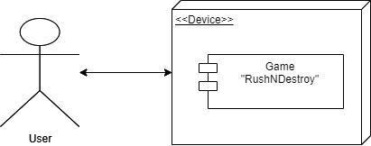

# 2D GAME
# Technical Specification

> Made by MAD_P Team

# Table of Contents

- [2D GAME](#2d-game)
- [Technical Specification](#technical-specification)
- [Table of Contents](#table-of-contents)
- [Introduction](#introduction)
  - [Purpose of this Document](#purpose-of-this-document)
- [System overview](#system-overview)
  - [UML Deployement Diagram](#uml-deployement-diagram)
- [High-Level Overview](#high-level-overview)
  - [Structural Aspects](#structural-aspects)
    - [Terminology](#terminology)
    - [Character data](#character-data)
    - [Structure data](#structure-data)
    - [Card data](#card-data)
    - [Deck data](#deck-data)
    - [Rewards data](#rewards-data)
    - [Main menu](#main-menu)
    - [Game menu](#game-menu)
    - [Gameplay scene](#gameplay-scene)
- [Technologies and tools used](#technologies-and-tools-used)

 

# Introduction

## Purpose of this Document

The purpose of this document is to provide the necessary technical information about this project for the up-keep and improving the 2D game.

# System overview
## UML Deployement Diagram
 

  
# High-Level Overview

In this document, inner workings of Unity game engine will not be explained as it is a very broad topic and understading of the inner workings is **essential** in order to work on this project.

## Structural Aspects

### Terminology
-  Unity game engine - a software framework primarily designed for the development of video games, and generally includes relevant libraries and support programs;
-  Singleplayer - a game that can only be played by one person;
-  Framerate - is the frequency (rate) at which consecutive images (frames) are captured or displayed;
-  2D -  a flat plane figure or a shape that has two dimensions: length and width;
-  Scene - it is the total space available to the player during the course of completing a discrete objective; 
-  Characters - dynamic entity that has certain properties (properties are listed below);
-  Structures - static entity that has certain properties (properties are listed below);
-  Entity - an instance of a character or a structure;
-  Spawning - live creation of a character in a game scene;
-  AI - the concept that machines can be improved to assume some capabilities normally thought to be like human intelligence such as learning, adapting, self-correction;
-  Scriptable Object (SO) - Unity's solution for storing dynamic data (similar to OOP solution);
-  Tilemap - is a grid system which stores and handles Tile Assets for creating 2D levels;
-  Prefab - acts as a template from which you can create new Prefab instances in the Scene. In our case, all entities are Prefabs.
-  Component - a term to describe an addable script (or collection of scripts), Unity's built-in UI components (Image, text, etc.) and other assets;
-  Game object - empty object that can store any component (usually it is used to create Prefabs);
-  "Sudden death" event - whichever team destroys any enemy structure first wins the game;
-  "Win" state - when enemy castle is destroyed;
-  "Lost" state - when player's castle is destroyed;
-  "Tie" state - when neither the player, nor the enemy managed to win the match;
-  Text - Unity's built-in Text component;
-  NavMesh - Unity's built-in navigation mesh component used for AI navigation;
-  SpriteRenderer2D - Unity's built-in component for rendering sprites (images).

### Character data
- Scriptable object which stores:
  - Player Prefab (prefabricated component):
    - Contains:
      - Unity built-in components:
        - SpriteRenderer2D (artowrk of player-themed character);
        - Rigidbody2D;
        - BoxCollider2D;
        - NavMesh Agent.
      - Custom created components:
        - UnitData script:
          - This script contains data constructors that are used for every entity to store their data (found in EntityData script) as well as AI states and targets.
        - Health bar component:
          - A rectangle shaped container to represent entity's health;
          - Slider script to adjust fill of a rectangle depending on health amount.
  - Enemy Prefab (prefabricated component):
    - Contains:
      - Unity built-in components:
        - SpriteRenderer2D (artowrk of enemy-themed character);
        - Rigidbody2D;
        - BoxCollider2D;
        - NavMesh Agent.
      - Custom created components:
        - UnitData script:
          - This script contains data constructors that are used for every entity to store their data (found in EntityData script) as well as AI states and targets.
        - Health bar component:
          - A rectangle shaped container to represent entity's health;
          - Slider script to adjust fill of a rectangle depending on health amount.
  - Card artowrk (used for cards in the deck during gameplay);
  - Entity type;
  - Target type;
  - Attack ratio;
  - Attack damage;
  - Attack range;
  - Health;
  - Mana cost;
  - Speed;
  - Upgrade level;
  - Upgrade cost;
  - Buy cost (for buyng the character from shop);
  - Owned (boolean which is used to know if the character is owned by the player).

### Structure data
- Scriptable object which stores:
  - Prefab (prefabricated component):
    - Contains:
      - Castle prefab and N number of tower prefabs:
        - Unity built-in components:
          - SpriteRenderer2D (artowrk of enemy-themed character);
          - Rigidbody2D;
          - BoxCollider2D;
          - NavMesh Agent.
        - Custom created components:
          - BuildingData script:
            - This script contains data constructors that are used for every entity to store their data (found in EntityData script) as well as AI states and targets.
          - Health bar component:
            - A rectangle shaped container to represent entity's health;
            - Slider script to adjust fill of a rectangle depending on health amount.
  - Entity type;
  - Target type;
  - Attack ratio;
  - Attack damage;
  - Attack range;
  - Health.

### Card data
- Scriptable object which stores:
  - EntityData scriptable object (for loading data to cards during gameplay).

### Deck data
- Scriptable object which stores:
  - List of all cards in the game (for loading data of all cards during gameplay).

### Rewards data
- Scriptable object which stores:
  - Coins amount;
  - Coins artwork (used to display near coins amount in menus);
  - Trophies amount;
  - Trophies artwork (used to display near coins amount in menus).

### Main menu
- Scene which contains all components that are needed for this scene. In this case, this scene has:
  - Camera component (for rendering the scene);
  - Background image;
  - Title
    - Text component that displays title of the menu.
  - Panel (it acts as an overlay on top of the background image);
  - "MainMenu" game object:
    - "Play" button:
      - Disables "MainMenu" game object;
      - Enables "PlayMenu" game object.
    - "Quit" button:
      - Saves current progress;
      - Closes the game (terminates the game).
  - "PlayMenu" game object:
    - "New Game" button:
      - Once clicked creates new save files with default values for entity and rewards data;
      - Loads "Game menu" scene.
    - "Continue" button:
      - Loads most recent save file;
      - Loads "Game menu" scene.
    - "Back to main menu" button:
      - Disables "PlayMenu" game object;
      - Enables "MainMenu" game object.

### Game menu
- Scene which contains all components that are needed for this scene. In this case, this scene has:
  - Camera component (for rendering the scene);
  - Background image;
  - Panel (it acts as an overlay on top of the background image);
  - "LevelMenu" game object:
    - Title
    -  Text component that displays title of the menu.
    - "PlayLevel" button:
      - Loads gameplay scene.
    - "Shop" button
      - Disables "LevelMenu" game object;
      - Enables "ShopMenu" game object.
  - "ShopMenu" game object:
    - Title
      - Text component that displays title of the menu.
    - Uppon loading:
      - Enables "UpgradableCards" game object;
      - Disables "BuyableCards" game object;
    - "Upgrade Cards" button:
      - Enables "UpgradableCards" game object;
      - Disables "BuyableCards" game object;
      - Loads all "owned" cards.
    - "Buy Cards" button:
      - Enables "BuyableCards" game object;
      - Disables "UpgradableCards" game object;
      - Loads all "not owned" cards;
    - "Back to main menu" button:
      - Loads "Main menu" scene;
      - Disables "PlayMenu" game object;
      - Enables "MainMenu" game object.

### Gameplay scene
- Scene which containts all components that are needed for this scene. In this case, this scene has:
  - Camera component (for rendering the scene);
  - "Managers" game object
    - It stores all scripts that are used to manage events during gameplay
      - GameManager script:
        - Handles:
          - AI states;
          - Target assignment;
          - Character spawning;
          - "Game over" states
            - Calculates rewards depending on whether the match was won, lost or tied;
              - Assigns calculated rewards to RewardsData scriptable object.
          - Death of entities;
          - Event alerts:
            - When mana generation speed changes;
            - When "sudden death" event is triggered.
      - CardManager script:
        - Manages:
          - Queued card creation;
          - Loading the Queued card with data from DeckData scriptable object;
          - Bringing the Queued card to one of main 4 slots in the card deck (if that slot is not occupied by other card).
        - When a card is dragged from the card slot in the deck onto "spawn zone" it checks whether there is enough mana generated. If there is enough mana it passes data from the card and position of the cursor to "Spawning" function in GameManager script.
      - SaveManager script:
        - Saves entities and rewards data to a file;
        - Loads ntities and rewards data from a save file.
      - AISpawning:
        - Spawns enemies in enemy's "spawn zone";
        - Spawning uses the same cards as the player;
        - Character to spawn and spawn location is selected randomly using Unity's built-in Random.Range() function;
        - Mana cost for AI spawnable characters is 1.5x higher than for the player. 
  - Canvas:
    - "Card deck" game object:
      - Deck image;
      - Mana bar:
        - A rectangle shaped container to represent mana amount;
            - Slider script to adjust fill of a rectangle depending on mana amount.
        - Mana image;
        - Mana amount as text.
      - Queued card placeholder;
      - "Active cards" game object:
        - Stores positions of available slots for queued cards.
    - Timer:
      - Text component;
      - Timer scirpt (for calculating remaining time and displaying it as text). 
    - "GameOver Menu" game object:
      - Text component for displaying "game over state";
      - Rewards Prefab for displaying rewards gained/lost.
      - "Back to Levels" button:
        - Loads "Game menu" scene.
    - "Text Alerts" game object:
      - Text component for displaying new event (change in mana generation time or start of "sudden death" event);
    - "PauseMenu" game object:
      - "Pause" button:
        - Enables "PauseMenuSelection" game object;
        - Freezes gameplay scene time.
      - "PauseMenuSelection" game object:
        - "Resume" button:
          - Disables "PauseMenuSelection" game object;
          - Unfreezes gameplay scene time.
        - "Back to Levels" button:
          - Loads "Game menu" scene.
        - "Back to Main menu" button:
          - Loads "Main menu" scene.
  - Tilemap game object:
    - Base map (unwalkable area);
      - Painted grid;
      - Unity's built-in TileMapCollider2D component;
      - NavMeshModifier.
    - Paths (walkable area);
      - Painted grid;
      - NavMeshModifier.
  - SpawnZone game object:
    - SpriteRenderer2D with spawn zone image as the sprite.
  - Player Structures Prefab;
  - Enemy Structures Prefab;

# Technologies and tools used
- Game engine [Unity Game Development Engine](https://unity.com);
- For creating wireframes, brainstorming [Miro](https://miro.com/);
- Version control for our codebase [GitLab](https://about.gitlab.com);
- Time tracking for weekly reports [Toggl](https://toggl.com);
- For creating graphical assets [Illustrator](https://www.adobe.com/products/photoshop.html);
- For connecting to VU MIF Gitlab [Cisco AnyConnect](https://santaka.vu.lt/display/DUK/Installing+and+using+VU+VPN);
- For figuring out how to use Unity game engine [Unity User Manual](https://docs.unity3d.com/Manual/index.html);
- For using built-in features of Unity game engine [Unity Scripting API](https://docs.unity3d.com/ScriptReference/).