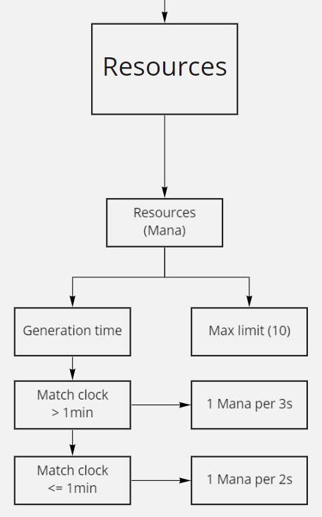

<!-- GEDIMINO KOMENTARAI IŠ FEEDBACKO -->

<!-- General comments:
- The fact that Unity is used is mentioned only in passing. I think that is a central piece of information. Another key piece of info - an overview of which aspects of the game are handled by Unity, and which parts are provided by your code. This is currently missing. From that an explanation how each of your parts should be/is implemented could follow.
- A good part of the document could be considered functional requirements (how things should function), while this document should explain how things should be implemented in Unity.
- I think a good deal of information could be extracted from the diagrams, but it would be important to: 1) use a clear and consistent notation; 2) introduce a higher-level diagram/text explaining the high-level view (that hides some details). For example, that the key concepts in the game's implementation are: a character, a structure, an attribute, a map, a difficulty, a reward, a resource, etc. And then lower-level diagrams could explain each concept further, e.g. what types of structures are there, which parts of their implementation are shared, etc.
- The approach of describing UI components is also a possible one, but it should be consistent - e.g. take a full window screenshot, then highlight what components are seen on it, and then go down into details explaining how each component is implemented. Now it only shows a tile map and health bar, but I believe there are many more components in the UI.

 

Specific comments:
- List of components used for game's structure - what is a component in this context? Somehow "Game world", "Spawn sound" and "Hit marker" do not seem to be things at the same level of abstraction. "Spawn sound" or "Hit marker" seems more like a graphical/audio asset, while "Game world" sounds like something bigger?
- Unity Entity Component System - it's difficult to understand the significance of this section without knowing what role the pools play/how they are used in the game. Also, the note about strctures appears before structures pool is mentioned. Shouldn't that be a lower-level bullet point?
- "Health system" - the first paragraph and "Visual entity health bar" section looks more like the description of the functional requirements for the health system (and therefore should be in the other specification).
- "Health system > Object purpose" - this seems like an explanation of how some Health Bar UI component should be implemented (i.e. that it is composed of multiple lower-level UI components (slider, border, etc.). This is useful. A way to improve it could be to be explicit about that by naming a section "Component: Health Bar" (or similar) and in it explaining everything about this component - what it should look like, what lower-level components it composes, etc.
- "State Machine" - UML State Diagram could have been used here (or any kind of an image, really). The problem with textual description is that it does not cover all state transitions. For example, for "Idle" it is said that "the next state is set" - but which state is "next"? Also, if a unit is in a "Fighting" state and kills its target, would it remain in "Fighting" state or go back to "Seeking" state?
- "Entity combat > Overall idea" - it's said that "when entities of different teams detect each other, they will start fighting to reach enemy’s castle", but previously it was said that "After being spawned the unit is targeting the enemy tower and moving forward to it. If interupted by opponent unit, the secondary target is set to the newly detected unit." - that seems to be inconsistent.
- "Entity combat > Overall idea" - "Cool additional feature that we are currently working ..." - that is something to track in project tasks lists, and maybe mention in weekly report, but not in the technical specification.
- "Entity combat > How it works" - that sounds more like functional requirements
- "UML Deployement Diagrams" - there are no UML deployment diagrams here, or even any UML diagrams for that matter :( If using your own notation, then you should explain what does a box mean, what does an arrow and its direction mean, etc.
- "UML Deployement Diagrams > Overview of whole diagram" - the image is not readable - the image quality is too low.
- "UML Deployement Diagrams > Rewards" - it's not clear why Resources and Rewards are grouped into one 
- "Technologies and tools used" - Some of these are not really mandatory for implementing the game. For example, another team could use Notepad, some other VCS, or another time tracking tool, but still be able to create an equivalent game. Because of that, these tools are more of a team's convention, rather than a hard requirement for the development of this/such game.
-->

<!-- REIKALAVIMAI IŠ EMOKYMAI PUSLAPIO -->

<!-- Purpose:
Build a shared understanding of how your system will be implemented
Communicate the architecture/design of your system to people outside of your team (imagine that you will e.g. give the requirements specification and the technical specification to a different team which will then have to build the system for you)

Process:
  Work together to prepare a technical specification
  Grant us (Gediminas and Virgilijus) access to the living technical specification document and inform us of it
  This means we need to have access to the place where an up to date specification can be found at any time
  The place should allow seeing the history of changes in the specification over time
  The way how we should be informed about granted access will be explained during exercises

Essential
An overview of the whole system
  System context diagram - to show what integrations with external systems your system will have (only if your system interacts with external systems)
  UML deployment diagram - to show what artifacts your system will consist of, and what infrastructure nodes they will be deployed on
A high-level overview of the system internals
  Structural aspects - to explain what are the main parts/modules/components and how they all connect together
  Dynamic aspects (interactions) - to explain how these components work together to achieve some larger goal
Technologies and tools that will be used to implement the system
Other notes
  The way how the internals of the system are explained depends a lot on the nature of the system that you are building. Because of that, it's not possible to say "to communicate your architecture and design, draw 1 diagram of this type, 2 diagrams of this type, and create a table like this". Instead, you should think along the lines of "what are the toughest problems/most complicated areas in our system?" and then focus on explaining those parts. For example:
  If your system has just two simple components that interact in many different ways, then maybe you'll want to focus mostly on explaining the nuances of all those different interactions using e.g. UML activity diagrams and/or UML sequence diagrams.
  If your system has a rich domain model, then maybe you'll want to focus mostly on explaining the static structure of the system - what entities you have, what are their responsibilities (operations), and how do they relate to other entities - e.g. using a UML class diagram.
  If your system is built around a complicated algorithm, then the most important thing would be to explain how this algorithm should be implemented - how exactly would it work, what parts would it have, etc.
  (These are just a few examples - your system may require a combined (or an entirely different) approach. What would be a good approach for your system can be discussed during exercises.)
  A good way to sanity-check your technical specifications is to answer the following questions to yourself:
  Is it clear what the main parts of the system are and how they fit together?
  Do I have enough details so I could go and just code the right solution, without having to think about how to solve the problem, which solution would be better, etc.?
  If a new developer joined your team and they read the requirements and technical specifications, would they be able to immediately start working on the system (i.e. would they know in which place of the codebase to look if they want to fix a bug related to feature X)?
  If you had this document at the beginning of your project, would it have made your work so much easier?
  If you see anything else that would help improve the shared understanding of the system - by all means, add it to the specification as well.
  Notes specific to student groups
  For the 1st group
  Each team prepares the technical specification for the whole system being created in the PBL project
  For the 2nd and 3rd groups
  The whole group must prepare a single technical specification document covering the whole system
  The whole group is responsible for the high-level description of the whole system
  Each team is responsible for describing the technical aspects of their module/area and making sure they are consistent with the specifications of both the whole system and the modules/areas of the other teams
Grading:

  Point distribution
  Up to 0.75 points will be granted upon delivery. Criteria:
  Primary:
    It is clear what are the main parts of the system, how they will fit together, and how each of those should be implemented
  Secondary:
    The document is written in clear language, the style is consistent and professional
  Missing the deadline for the initial delivery means 0 points for the whole team
  Your team will know how many points it got shortly after submitting the delivery.
  Up to 0.25 points will be granted at the end of the semester.
  Criteria:
    Primary:
      The specification is up to date - i.e. it reflects the current understanding of the technical aspects of the system
    Secondary:
      All of the requirements for the initial delivery - they are still valid -->

# 2D GAME

# Technical Specification

> Made by MAD_P Team

## Table of Contents

- [2D GAME](#2d-game)
- [Technical Specification](#technical-specification)
  - [Table of Contents](#table-of-contents)
- [Introduction](#introduction)
  - [Purpose of this Document](#purpose-of-this-document)
- [System overview](#system-overview)
  - [UML Deployement Diagrams](#uml-deployement-diagrams)
- [High-Level Overview](#high-level-overview)
  - [Structural Aspects](#structural-aspects)
    - [Data of entities](#data-of-entities)
    - [Character data](#character-data)
      - [**Overall idea**](#overall-idea)
- [Technologies and tools used](#technologies-and-tools-used)
  - [Game engine](#game-engine)
    - [Unity Game Development Engine](#unity-game-development-engine)
  - [For creating wireframes, brainstorming](#for-creating-wireframes-brainstorming)
    - [Miro](#miro)
  - [Version control for our codebase](#version-control-for-our-codebase)
    - [Gitlab](#gitlab)
  - [Time tracking for weekly reports](#time-tracking-for-weekly-reports)
    - [Toggl](#toggl)
  - [For creating graphical assets](#for-creating-graphical-assets)
    - [Illustrator](#illustrator)
  - [For connecting to VU MIF Gitlab](#for-connecting-to-vu-mif-gitlab)
    - [Cisco AnyConnect](#cisco-anyconnect)
  - [For figuring out how to use Unity game engine](#for-figuring-out-how-to-use-unity-game-engine)
    - [Unity User Manual](#unity-user-manual)
  - [For using built-in features of Unity game engine](#for-using-built-in-features-of-unity-game-engine)
    - [Unity Scripting API](#unity-scripting-api)
    

 

# Introduction

## Purpose of this Document

The purpose of this document is to provide the necessary technical information about this project for the up-keep and improving the 2D game.

# System overview
## UML Deployement Diagrams

1. Characters and Structures
   
  
2. Menu UI
   
  
3. AI
   
  
4. Rewards
   
  
   
5. Resources
   
  
6. Arenas
   
  
  
# High-Level Overview

In this document, inner workings of Unity game engine will not be explained as it is a very broad topic and understading of the inner workings is **essential** in order to work on this project.

## Structural Aspects

### Data of entities
In this document **entities** are used to describe characters and structures in one word.
### Character data
- Prefab
  - Contains:
    - Unity built-in components:
      - Sprite renderer
      - Rigidbody2D
      - BoxCollider2D
      - NavMesh Agent
    - Custom created components:
      - UnitData script:
        - This script contains data constructors that are used for every character to store their data (found in EntityData script) as well as AI states and targets.
      - Health bar component:
        - A rectangle shaped container to represent character's health:
          - Slider

#### **Overall idea**

In the game when entities of different teams detect each other, they will start fighting to reach enemie’s castle. For this to work, these game objects need to be able to receive and deal damage to other objects. Different enemy entities will not have the same responses to start attacking. By design some entities are more agile and will perform the attack quicker than others. By design, their attacks will deal slightly less damage than standard numbers. On the other hand, entites with slower reflexes will deal increased damage.

# Technologies and tools used

## Game engine
### [Unity Game Development Engine](https://unity.com)

## For creating wireframes, brainstorming
### [Miro](https://miro.com/)

## Version control for our codebase
### [Gitlab](https://about.gitlab.com)

## Time tracking for weekly reports
### [Toggl](https://toggl.com)

## For creating graphical assets
### [Illustrator](https://www.adobe.com/products/photoshop.html)

## For connecting to VU MIF Gitlab
### [Cisco AnyConnect](https://www.cisco.com/c/en/us/products/security/anyconnect-secure-mobility-client/index.html)

## For figuring out how to use Unity game engine
### [Unity User Manual](https://docs.unity3d.com/Manual/index.html)

## For using built-in features of Unity game engine
### [Unity Scripting API](https://docs.unity3d.com/ScriptReference/)
